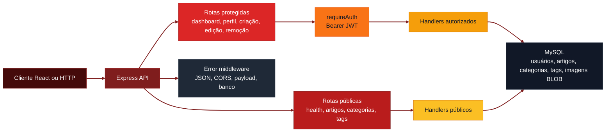
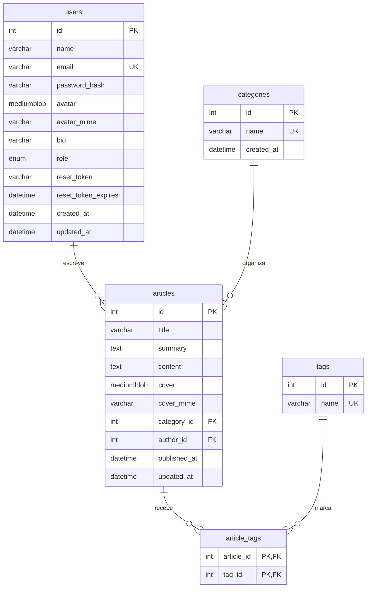
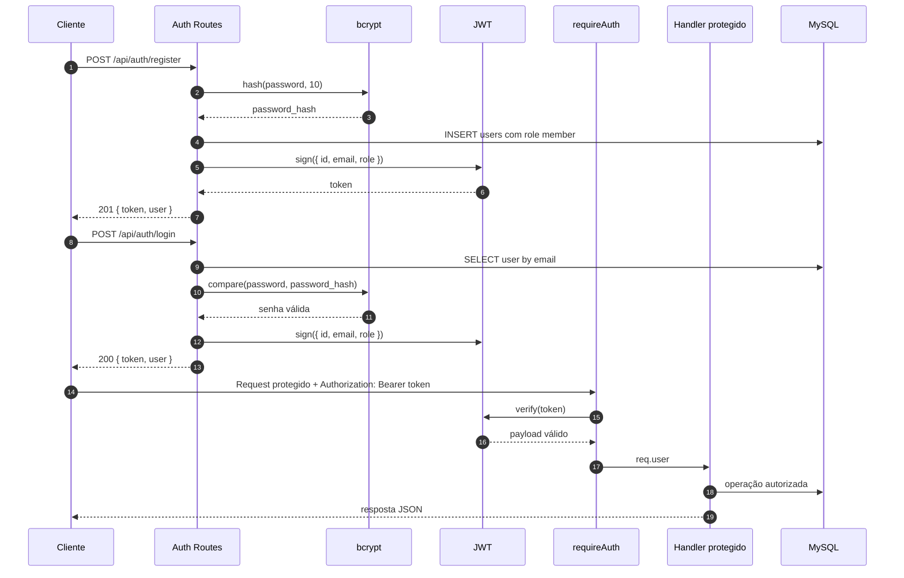

# Blog Mind Group - Backend

<p align="center">
  
  
  
  
</p>

<p align="center">
  
  
  
  
  
  
  
</p>

<p align="left">
  <strong>API REST para um blog full stack com autenticação JWT, artigos protegidos, perfis e imagens salvas em BLOB.</strong><br />
  Backend do desafio Mind Group, construído com Node.js, Express, TypeScript e MySQL para servir o frontend React do projeto.
</p>


---

## Visão geral

**Blog Mind Group - Backend** é uma API REST para o desafio de blog. Inclui autenticação JWT, cadastro, login, recuperação de senha, CRUD protegido de artigos, categorias, tags, dashboard do usuário, perfil com avatar e dump MySQL para importação.

O backend separa leitura pública de escrita autenticada:

1. Visitantes listam e visualizam artigos.
2. Usuários cadastrados criam artigos e editam/removem apenas seus próprios artigos.
3. Administradores podem editar/remover artigos de qualquer autor.
4. Imagens de avatar e capa são recebidas como data URL base64, decodificadas e salvas como `MEDIUMBLOB` no MySQL.

O foco da entrega é facilitar a avaliação local: clonar, instalar, importar `dump.sql`, configurar `.env` e rodar a API.

---

## Demo

<p align="center">
  
</p>

---

## Fluxo



---

## Modelo de dados

O ERD abaixo reflete o `dump.sql` atual. As tabelas `categories` e `tags` não possuem coluna `slug` no dump. A coluna real de senha é `password_hash`, não `password`.



---

## Fluxo de autenticação



---

## Stack

- **Node.js 20+** para runtime JavaScript no backend.
- **Express** para rotas HTTP e middlewares.
- **TypeScript** para tipagem e build seguro.
- **MySQL 8+** para persistência relacional.
- **mysql2** para conexão com o banco.
- **JWT** para autenticação stateless.
- **bcryptjs** para hash de senha.
- **Docker** para banco local e imagem enxuta da API.

---

## Requisitos

- Node.js 20+
- MySQL 8+
- npm
- Docker Desktop opcional, recomendado para subir MySQL local rapidamente

---

## Setup

```powershell
cd "D:\Dev\Projects\Mind Group\blog-backend"
npm install
Copy-Item .env.example .env
npm run dev
```

API local:

```text
http://localhost:3333
```

Health check:

```powershell
curl http://localhost:3333/api/health
```

Antes de rodar a API, suba o MySQL com Docker ou importe o `dump.sql` em uma instalação local de MySQL. O `.env.example` já vem configurado para o MySQL do Docker Compose na porta `3307`.

---

## Setup Docker

```powershell
cd "D:\Dev\Projects\Mind Group\blog-backend"
docker compose up -d mysql
npm install
npm run dev
```

Esse modo usa MySQL em Docker na porta `3307` e importa `dump.sql` automaticamente na primeira criação do volume.

```text
Host: 127.0.0.1
Porta: 3307
Usuário: root
Senha: mindgroup
Banco: mind_group_blog
```

Para criar a imagem local da API:

```powershell
docker build -t mind-group-blog-backend .
```

Se o volume do MySQL já existir e você quiser recriar o banco do zero, remova o volume antes de subir novamente:

```powershell
docker compose down -v
docker compose up -d mysql
```

---

## Acesso para teste

O dump inclui dados de exemplo para listagem pública:

- 1 usuário admin
- 6 categorias
- 5 tags
- 3 artigos de exemplo

Credencial local do usuário admin criado pelo `dump.sql`:

```text
Email: admin@mindgroup.com
Senha: Admin@123
```

Essa credencial é apenas seed local de avaliação. Não use em produção.

---

## Variáveis

```env
PORT=3333
CLIENT_ORIGIN=http://localhost:5173,http://127.0.0.1:5173,http://localhost:4173,http://127.0.0.1:4173

DB_HOST=127.0.0.1
DB_PORT=3307
DB_USER=root
DB_PASSWORD=mindgroup
DB_NAME=mind_group_blog

JWT_SECRET=replace_this_with_a_long_random_secret
JWT_EXPIRES_IN=7d
```

| Variável | Descrição | Exemplo |
|---|---|---|
| `PORT` | Porta HTTP da API | `3333` |
| `CLIENT_ORIGIN` | Origens liberadas no CORS, separadas por vírgula | `http://localhost:5173,http://127.0.0.1:5173` |
| `DB_HOST` | Host do MySQL | `127.0.0.1` |
| `DB_PORT` | Porta do MySQL | `3307` |
| `DB_USER` | Usuário do banco | `root` |
| `DB_PASSWORD` | Senha do banco | `mindgroup` |
| `DB_NAME` | Nome do banco | `mind_group_blog` |
| `JWT_SECRET` | Segredo usado para assinar tokens JWT | `replace_this_with_a_long_random_secret` |
| `JWT_EXPIRES_IN` | Tempo de expiração do JWT | `7d` |

---

## Rotas

### Sistema

| Método | Rota | Auth | Descrição |
|---|---|---|---|
| `GET` | `/api/health` | Não | Verifica API e conexão com MySQL |

### Auth

| Método | Rota | Auth | Descrição |
|---|---|---|---|
| `POST` | `/api/auth/register` | Não | Cadastro com nome, email, senha e confirmação |
| `POST` | `/api/auth/login` | Não | Login com email/senha e retorno de JWT |
| `POST` | `/api/auth/forgot-password` | Não | Gera token de reset sem revelar se email existe |
| `POST` | `/api/auth/reset-password` | Não | Redefine senha com token válido |

### Usuários

| Método | Rota | Auth | Descrição |
|---|---|---|---|
| `GET` | `/api/users/me` | Sim | Perfil do usuário logado |
| `PUT` | `/api/users/me` | Sim | Atualiza `name`, `email`, `bio` e `avatar` opcional em data URL base64 |
| `GET` | `/api/users/:id` | Não | Perfil público de autor e artigos publicados |

### Artigos

| Método | Rota | Auth | Descrição |
|---|---|---|---|
| `GET` | `/api/articles` | Não | Lista artigos com `search`, `categoryId` e `page` |
| `GET` | `/api/articles/:id` | Não | Retorna artigo completo |
| `POST` | `/api/articles` | Sim | Cria artigo com categoria, tags e `coverImage` opcional |
| `PUT` | `/api/articles/:id` | Sim | Edita artigo do autor ou admin |
| `DELETE` | `/api/articles/:id` | Sim | Remove artigo do autor ou admin |

### Categorias e tags

| Método | Rota | Auth | Descrição |
|---|---|---|---|
| `GET` | `/api/categories` | Não | Lista categorias para dropdown |
| `GET` | `/api/tags` | Não | Lista tags cadastradas |

### Dashboard

| Método | Rota | Auth | Descrição |
|---|---|---|---|
| `GET` | `/api/dashboard` | Sim | Total de artigos do usuário e últimos 5 artigos publicados |

---

## Scripts

```powershell
npm run dev
npm run build
npm run smoke
npm start
```

| Script | Descrição |
|---|---|
| `npm run dev` | Sobe a API com `tsx watch` |
| `npm run build` | Compila TypeScript para `dist/` |
| `npm run smoke` | Roda smoke test de API com banco ativo |
| `npm start` | Executa `node dist/server.js` |

---

## Dump

Arquivo de entrega:

```text
dump.sql
```

O dump cria o banco `mind_group_blog`, recria as tabelas, aplica chaves estrangeiras, cria índices e insere dados iniciais.

Tabelas criadas:

- `users`
- `categories`
- `tags`
- `articles`
- `article_tags`

Dados iniciais:

- 1 admin local
- 6 categorias
- 5 tags
- 3 artigos de exemplo

Importação manual:

```powershell
mysql -h 127.0.0.1 -P 3307 -u root -pmindgroup < dump.sql
```

Se usar MySQL local fora do Docker, ajuste `DB_HOST`, `DB_PORT`, `DB_USER` e `DB_PASSWORD` no `.env` antes de importar:

```powershell
mysql -u root -p < dump.sql
```

---

## Estrutura do projeto

```text
blog-backend/
├── src/
│   ├── app.ts                    # Express app e registro de rotas
│   ├── server.ts                 # Bootstrap HTTP
│   ├── config/
│   │   └── env.ts                # Variáveis de ambiente
│   ├── database/
│   │   ├── connection.ts         # Pool mysql2
│   │   └── schema.sql            # Referência para dump
│   ├── middlewares/
│   │   ├── auth.middleware.ts    # JWT Bearer
│   │   └── error.middleware.ts   # Erros esperados
│   ├── routes/
│   │   ├── auth.routes.ts
│   │   ├── user.routes.ts
│   │   ├── article.routes.ts
│   │   ├── category.routes.ts
│   │   ├── tag.routes.ts
│   │   └── dashboard.routes.ts
│   └── utils/
│       ├── http.ts
│       ├── jwt.ts
│       └── validation.ts
├── scripts/
│   └── smoke.ts                  # Smoke test local
├── banner.png
├── photo.png
├── compose.yaml                  # MySQL local
├── Dockerfile                    # Imagem da API
├── dump.sql                      # Dump importável
├── LICENSE.txt                   # Licença MIT
├── .env.example
└── README.md
```

---

## Contribuindo

Contribuições são bem-vindas.

1. Faça um fork do repositório.
2. Crie uma branch: `git checkout -b feature/sua-feature`.
3. Commit suas alterações: `git commit -m "feat: minha contribuição"`.
4. Push da branch: `git push origin feature/sua-feature`.
5. Abra um Pull Request com um resumo das alterações.

Use [Conventional Commits](https://www.conventionalcommits.org/): `feat:`, `fix:`, `docs:`, `style:`, `refactor:`, `test:`, `chore:`.

---

## Licença

Este projeto está licenciado sob a licença **MIT**. Veja [LICENSE.txt](./LICENSE.txt).

---

<p align="center">
  Desenvolvido com ☕ por <a href="https://github.com/devAndreotti">devAndreotti</a>
</p>
